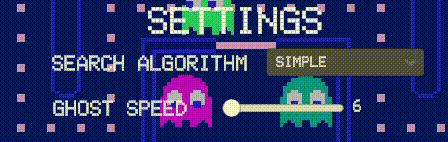
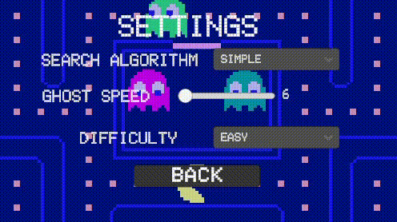
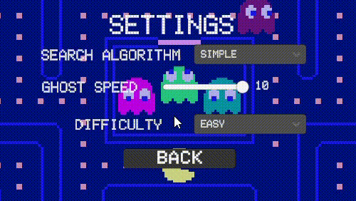

# Pacman Game with Search Algorithms
A classic Pacman game implementation with three search algorithms: Simple Search, Simple+ Search, and Breadth-First Search (BFS).

## Features
Play the iconic Pacman game with a graphical interface.
Choose between three search algorithms to control the behavior of the ghosts:
- Simple Search: Basic ghost movement towards Pacman.
- Simple+ Search: Improved ghost movement that search point in front of pacman, that provide better pathfinding.
- Breadth-First Search (BFS): Ghosts find the shortest path to Pacman using BFS.
## Installation
To start the program, follow the steps below:

 1. Download project zip-file from https://github.com/Eramcheg/uPacman2D.git
 2. Unpack downloaded zip-file
 3. Navigate to the Game/ directory and unpack zip-file Pacman.zip
 4. Navigate to Pacman/ folder and open Pacman.exe

 This will launch application and your game session will be started.

## Usage
In application you can pause game with Menu button and navigate to settings, where you can:
1.  Change game algorithm, now there are three algorithms : 
 -  Simple
 - Simple+
 - BFS.
- 
2. Change ghosts speed to add challenge to your game.
- 
3. Change ghosts difficulty to Easy, Medium or Hard.
- 

## Support
If you need any help or have any questions, you can reach out to us at [eramcheg@gmail.com].

## Roadmap
Here are some planned features for future releases:
- Add DFS algorithm to increase ghosts search algorithms 
- Add Dijkstruv algorithm to increase ghosts seatch algorithms
- Design new levels for more challenging 

## Contributing
This project is for educational purposes.

## Authors
This project was developed by Salohub Illia, student of Charles University in Prague.

## License
This project is licensed under the [MIT License](https://opensource.org/license/MIT/).

## Acknowledgment
This project was developed as part of the Programming 2 [NPRG031] course. Special thanks to the course instructors.

